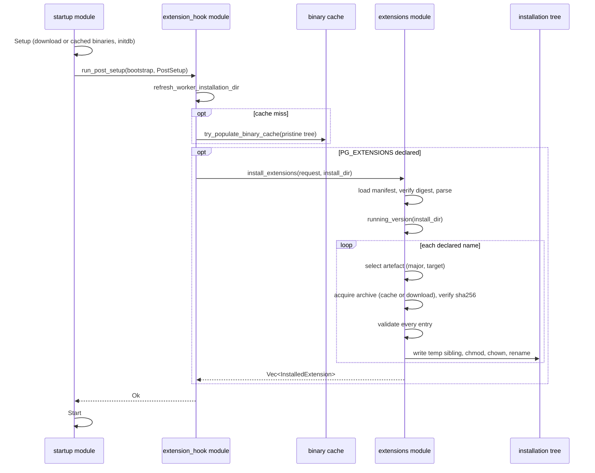

# Prebuilt extensions

The Theseus `postgresql-binaries` archives that `pg_embedded_setup_unpriv`
downloads carry only the in-tree contrib extensions. Out-of-tree extensions
such as `pgvector` are installed by the extension hook: before the server
starts, the hook fetches a digest-pinned manifest, selects the archive built
for the running PostgreSQL major and for this crate's compile target, verifies
the archive against the digest in the manifest, and copies its files into the
embedded tree. The hook never compiles anything; when no matching, verified
archive exists it fails closed and the server is not started.

The archives and manifest are published by
[`df12-pg-extensions`](https://github.com/leynos/df12-pg-extensions), whose
release workflow is the estate's one permitted source build.

## Declaring extensions

Table: Environment variables read by the extension hook.

| Variable                        | Meaning                                                                                                                                                                  |
| ------------------------------- | ------------------------------------------------------------------------------------------------------------------------------------------------------------------------ |
| `PG_EXTENSIONS`                 | Comma-separated `CREATE EXTENSION` names, for example `vector`. Unset, empty or whitespace leaves the hook inert.                                                        |
| `PG_EXTENSIONS_MANIFEST`        | Location of `manifest.json`: an `https://` URL or a filesystem path. Required when `PG_EXTENSIONS` is set.                                                               |
| `PG_EXTENSIONS_MANIFEST_SHA256` | Lower-case hex SHA-256 of the manifest bytes. Required for an HTTPS manifest; optional for a path. Pinning the manifest digest pins every archive it describes.          |
| `PG_EXTENSIONS_CACHE_DIR`       | Where verified archives are kept between runs. Defaults to `$XDG_CACHE_HOME/pg-embedded/extensions`, then `~/.cache/pg-embedded/extensions`, then a temporary directory. |

`TestCluster`, `bootstrap_for_tests`, `run()` and the
`pg_embedded_setup_unpriv` CLI all honour these variables. A consumer that
manages its own `Settings` can call `extensions::install_extensions` directly
with an `ExtensionRequest`.

```bash
export PG_VERSION_REQ="=17.11.0"
export PG_EXTENSIONS="vector"
export PG_EXTENSIONS_MANIFEST="https://github.com/leynos/df12-pg-extensions/releases/download/v1.0.0/manifest.json"
export PG_EXTENSIONS_MANIFEST_SHA256="<digest from manifest.json.sha256>"
```

Matching is on the PostgreSQL major and the compile target triple
(`PG_EMBED_TARGET`, exported by `build.rs`), never the minor: a module built
for one major loads into every minor of that major, because the server's
`Pg_magic_func` block checks the major and the layout constants only, and an
archive built before 16.5 was measured loading into Theseus 16.15. The
`postgresql` field of an artefact records the exact Theseus release it was
built against as information. So `PG_VERSION_REQ` may pin a major (`^17`)
rather than an exact release.

## Manifest schema

Schema version 1. Every field is required; a manifest with another
`schema_version` is rejected outright.

```json
{
  "schema_version": 1,
  "release": "v1.0.0",
  "generated_at": "2026-09-06T00:00:00+00:00",
  "extensions": [
    {
      "name": "vector",
      "package": "pgvector",
      "version": "0.8.6",
      "source": {
        "repository": "https://github.com/pgvector/pgvector",
        "tag": "v0.8.6",
        "commit": "8ee86c96f0fd72390f890aa8a336fda6d3ab4c6c"
      },
      "artifacts": [
        {
          "postgresql": "17.11.0",
          "target": "x86_64-unknown-linux-gnu",
          "file": "pgvector-0.8.6-pg17.11.0-x86_64-unknown-linux-gnu.tar.gz",
          "url": "https://github.com/leynos/df12-pg-extensions/releases/download/v1.0.0/pgvector-0.8.6-pg17.11.0-x86_64-unknown-linux-gnu.tar.gz",
          "sha256": "<64 lower-case hex digits>",
          "size": 102961,
          "files": [
            "lib/vector.so",
            "share/extension/vector--0.8.6.sql",
            "share/extension/vector.control"
          ]
        }
      ]
    }
  ]
}
```

An archive is a gzip tar of regular files under exactly two prefixes relative
to the PostgreSQL install root: `lib/` (one level deep) and `share/extension/`.
Directory entries are tolerated. Symlinks, hard links, device nodes, absolute
paths, `..` components, any other prefix, and any difference between the
archive contents and the manifest `files` list are rejected before a single
file is written.

## Install procedure

1. Fetch the manifest (size-capped at 1 MiB), verify its digest when one is
   pinned, parse and validate it.
2. Identify the running PostgreSQL from the versioned installation
   directory name, falling back to `bin/pg_config --version`.
3. For each declared name, select the artefact for that name, PostgreSQL
   major and target.
4. Reuse `<cache>/<sha256>/<file>` when its digest still matches; otherwise
   download to a temporary file under a per-digest lock, verify, and rename
   into place.
5. Validate every archive entry, then write each file to a temporary
   sibling and rename it over the destination (so a mapped shared object is
   replaced by a new inode, never truncated). Modes are `0o755` under `lib/` and
   `0o644` under `share/extension/`; on Unix the files are chowned to the
   installation directory's owner so the demoted worker can remove them. A
   destination that already holds identical bytes is left untouched.
6. Log one `pg_embed::extensions` event per extension and expose the
   result through `ClusterHandle::installed_extensions()`.

The hook runs in the parent process after `Setup` and before `Start` in every
lifecycle (synchronous, asynchronous and the CLI's setup-only path).
Binary-cache population moves to just before the hook, so the shared binary
cache never contains extension files.

## Cache layout

```plaintext
{extensions_cache_dir}/
  .locks/
    <sha256>.lock
  <sha256>/
    pgvector-0.8.6-pg17.11.0-x86_64-unknown-linux-gnu.tar.gz
```

## Failure modes

Every failure surfaces as a `BootstrapError` whose kind names the cause. The
server is not started and nothing is compiled.

Table: Extension error kinds.

| `BootstrapErrorKind`              | Trigger                                                                                             |
| --------------------------------- | --------------------------------------------------------------------------------------------------- |
| `ExtensionConfigInvalid`          | Names declared without a manifest, an HTTPS manifest without a digest, a malformed name or digest   |
| `ExtensionManifestUnavailable`    | The manifest path is missing or the URL cannot be fetched                                           |
| `ExtensionManifestDigestMismatch` | The manifest bytes do not hash to `PG_EXTENSIONS_MANIFEST_SHA256`                                   |
| `ExtensionManifestInvalid`        | Invalid JSON, wrong `schema_version`, missing field, malformed digest or version                    |
| `ExtensionUnavailable`            | No artefact for the name, running PostgreSQL major, and target; also an unidentifiable PostgreSQL   |
| `ExtensionArchiveUnavailable`     | The archive cannot be downloaded and no valid cached copy exists                                    |
| `ExtensionArchiveDigestMismatch`  | The downloaded bytes do not hash to the manifest digest                                             |
| `ExtensionArchiveInvalid`         | A forbidden entry, a path outside the prefixes, or contents that differ from the manifest file list |
| `ExtensionInstallFailed`          | An I/O failure writing into the tree; the message lists the files already written                   |

## Install sequence

Figure: Extension installation between `Setup` and `Start`.


